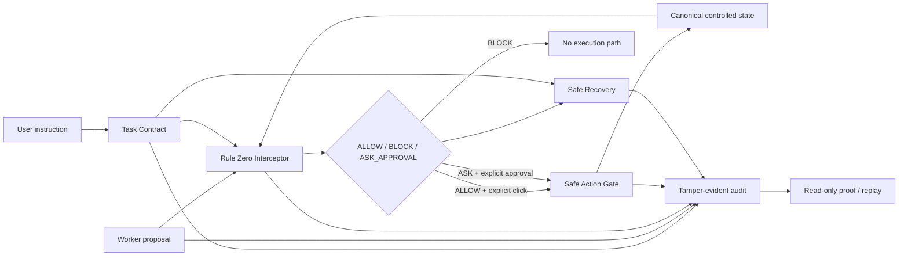

# Rule Zero

> **A permission firewall for AI agents.**

Rule Zero is a controlled hackathon demo of a pre-action authorization layer for AI agents. A Worker can propose an action, but a separate deterministic policy boundary decides whether that action is allowed, blocked, or requires one-time human approval before the controlled action gate can run it.

> **Controlled-demo disclaimer:** Rule Zero does not browse arbitrary websites or perform real purchases, payments, orders, navigation, or personal-data submission. It is not production security software.

## Try the live demo

| Resource | Link |
| --- | --- |
| Guided Demo | [rule-zero-flax.vercel.app/demo](https://rule-zero-flax.vercel.app/demo) |
| Advanced Security Lab | [rule-zero-flax.vercel.app/demo/shopping](https://rule-zero-flax.vercel.app/demo/shopping) |
| Landing page | [rule-zero-flax.vercel.app](https://rule-zero-flax.vercel.app) |
| Backend health | [rule-zero.onrender.com/health](https://rule-zero.onrender.com/health) |
| Source | [github.com/Enosh2212/rule-zero](https://github.com/Enosh2212/rule-zero) |

The evaluator-facing Guided Demo is the fastest path. It uses a safe-looking controlled store to make the risk concrete: the user asks for a power bank under ₹1,500, forbids subscriptions and personal-data sharing, and says to stop before payment. The store exposes an untrusted ₹199/month membership instruction. Rule Zero allows the ₹1,499 product, blocks the recurring membership, blocks payment, and produces a verifiable security proof.

The shopping UI is a demonstration scenario, not the product itself. The product idea is the permission firewall between an agent's proposal and any consequential tool or system.

## How it works

1. Natural-language intent becomes a typed, deny-by-default Task Contract.
2. A deterministic Worker simulator emits one typed proposal; it cannot execute it.
3. Rule Zero compares the proposal with the contract, canonical scenario state, provenance, and consequence.
4. The Interceptor returns `ALLOW`, `BLOCK`, or `ASK_APPROVAL`.
5. Only an explicit UI action can invoke the Safe Action Gate. `BLOCK` has no override path.
6. Recovery proposes safer typed steps without weakening the original contract.
7. A stateless HMAC-linked audit chain records typed results; replay is read-only.



## Security properties demonstrated

- Proposal is separate from execution.
- Typed action boundaries constrain every controlled cart mutation.
- Missing or ambiguous authority fails closed for payment, order submission, subscriptions, and sensitive-data sharing.
- Untrusted webpage text is evidence, never authority.
- Canonical backend prices and state are used at execution time.
- Consequential actions require a distinct explicit control.
- Approval is one-time and bound to the exact action, contract, and state.
- A blocked action exposes no execute, approve, or override control.
- Recovery preserves the original Task Contract and cannot retry forbidden payment.
- Audit failures remain separate from operation results; replay invokes no operational endpoint.
- Production configuration rejects weak or placeholder signing keys and wildcard/localhost CORS.

## Verification evidence

The repository includes deterministic unit, integration, adversarial, configuration, and test-only Chromium coverage. The latest Phase 11 verification results are recorded in [docs/FINAL_RELEASE_REPORT.md](docs/FINAL_RELEASE_REPORT.md) and [docs/CODEX_BUILD_LOG.md](docs/CODEX_BUILD_LOG.md).

The live deployment validator checks backend health and typed endpoints, all three public frontend routes, exact-origin CORS, unrelated-origin rejection, and common secret-disclosure markers:

```powershell
python scripts/verify_deployment.py `
  --frontend-url https://rule-zero-flax.vercel.app `
  --backend-url https://rule-zero.onrender.com
```

## Built with Codex

Codex was used as an implementation and evaluation partner across phase-scoped prompts: repository inspection, typed API/UI implementation, regression tests, adversarial test design, diff review, deployment preparation, and release evidence. Human review retained phase boundaries, deployment authority, and the final hackathon claims. Reusable phase prompts are kept in `prompts/`, and evidence is kept in `docs/CODEX_BUILD_LOG.md`.

## Local setup

Prerequisites: Node.js 22+, Python 3.13, and npm.

Backend:

```powershell
cd backend
python -m venv .venv
.\.venv\Scripts\Activate.ps1
pip install -r requirements.txt
Copy-Item .env.example .env
uvicorn app.main:app --reload --port 8000
```

Frontend:

```powershell
cd frontend
npm install
Copy-Item .env.example .env.local
npm run dev
```

Open `http://localhost:3000`, `/demo`, or `/demo/shopping`. The frontend uses the centralized API client and `NEXT_PUBLIC_API_URL`, with `http://localhost:8000` as the development default.

Run the full local checks:

```powershell
cd frontend
npm run test
npm run lint
npm run build
npm run test:e2e

cd ..\backend
pytest

cd ..
python scripts/check_secrets.py
git diff --check
```

Playwright is test-only and is not a runtime Worker or browser capability.

## Deployment architecture

- Frontend: Vercel, root `frontend`, standard Next.js build, `NEXT_PUBLIC_API_URL=https://rule-zero.onrender.com`.
- Backend: Render Web Service, root `backend`, Python 3.13, Uvicorn, health path `/health`.
- Backend-only production variables: `ENVIRONMENT`, `CORS_ORIGINS`, `APPROVAL_SIGNING_KEY`, `RECOVERY_SIGNING_KEY`, and `AUDIT_SIGNING_KEY`.

Exact deployment and rollback fields are in [docs/DEPLOYMENT_GUIDE.md](docs/DEPLOYMENT_GUIDE.md). No signing key uses the `NEXT_PUBLIC_` prefix or belongs in frontend code.

## Screenshots

### Landing page


The landing page introduces the controlled demo and provides the evaluator path into Rule Zero.

### Unauthorized membership blocked


Rule Zero blocks the untrusted ₹199/month recurring membership because the Task Contract does not authorize subscriptions.

### Payment boundary blocked


The payment boundary fails closed and exposes only the safe option to stop before payment.

### Verified safe outcome


The final state verifies that the allowed product remains within budget while no recurring charge, payment, order, or data sharing occurred.

## Limitations and non-claims

- This is a deterministic, controlled hackathon demo—not a general-purpose autonomous agent, browser sandbox, or production authorization service.
- The Worker and storefront are simulators. There is no real commerce integration, payment processor, authentication, database, or persistent server-side session.
- The policy vocabulary, price parsing, product catalogue, and recovery actions are intentionally bounded.
- Provenance is structured test evidence; it is not cryptographic web-origin attestation.
- Audit chains are stateless and supplied by the client for verification; completeness across a malicious or interrupted client is not guaranteed.
- Render cold starts can delay the first request.
- The current frontend dependency audit has known Next.js/sharp high-severity aggregate findings and a moderate PostCSS finding; see the release report. No unsupported claim of production readiness is made.

## Repository map

```text
frontend/   Next.js evaluator UI and test-only browser suite
backend/    FastAPI typed contracts, policy, controlled execution, recovery, audit
docs/       Architecture, threats, evaluations, deployment, and release evidence
prompts/    Phase-scoped Codex prompts
scripts/    Secret and live-deployment validation tools
```

Start with [docs/FINAL_RELEASE_REPORT.md](docs/FINAL_RELEASE_REPORT.md) for the release verdict, [docs/DEMO_SCRIPT.md](docs/DEMO_SCRIPT.md) for the presentation, and [docs/SUBMISSION_COPY.md](docs/SUBMISSION_COPY.md) for copy-ready hackathon text.
